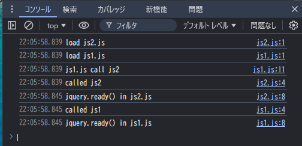
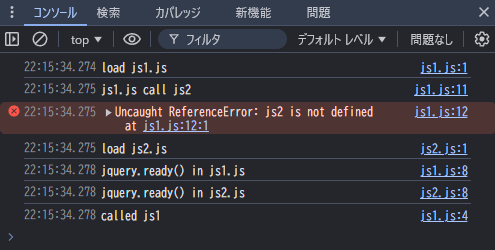
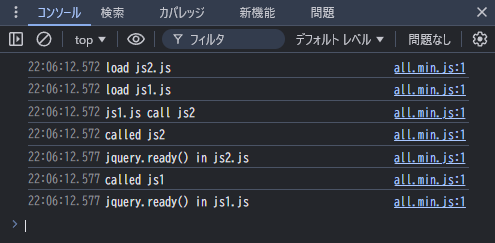

# モジュール形式ではない古い形式のjsファイルを読み込み順を考慮して結合する(uglify-js)

## はじめに

[以前](https://github.com/murasuke/concat_conventional_js)、[gulp](https://github.com/gulpjs/gulp)を利用して古い形式のjsファイルを結合してみました。

他のツールも調べ、[UglifyJS](https://github.com/mishoo/UglifyJS)でも結合できそうなので試してみました。

※Rollupなど新しいバンドラーではモジュール形式ではない古い形式のjsファイルの読み込みができないため

結合するjsファイル
1. jquery ・・・js1, js2で利用するので一番最初に読み込む必要がある
2. js2.js ・・・js1から呼び出されるため、js2を先に読み込む必要がある
3. js1.js ・・・js2を呼び出すため最後に読み込む(名前順(js1⇒js2)に読み込まれるとエラーになる)

* js2.js

```js:js2.js
console.log('load js2.js');

function js2() {
	console.log('called js2');
}

$(function() {
	console.log('jquery.ready() in js2.js');
	js1();
});

```

* js1.js

```js:js1.js
console.log('load js1.js');

function js1() {
	console.log('called js1');
}

$(function() {
	console.log('jquery.ready() in js1.js');
});

console.log('js1.js call js2');
js2();

```

## &lt;script&gt;タグでファイル順を考慮して読み込んでテスト

* テスト用html

jsファイル間の依存順を考慮して読み込んでいます(jqery⇒js2⇒js1)

```html:index.html
<!DOCTYPE html>
<html lang="ja">
  <head>
    <meta charset="UTF-8">
    <title>js test</title>
    <script src="js/jquery-3.7.1.min.js"></script>
    <script src="js/js2.js"></script>
    <script src="js/js1.js"></script>
  </head>
  <body>
  </body>
</html>
```

ログ(j2を先に読み込んでいるため、呼び出しエラーにならない)


※もしjs1⇒js2の順でで読み込むと未定義エラーが発生する



## uglify-jsでファイル間の依存関係(読み込み順)を考慮して結合する

* 結合順にファイルを指定して、1ファイルに結合します

```bash
$ npx uglifyjs ./js/jquery-3.7.1.min.js ./js/js2.js ./js/js1.js -o ./js/all.min.js
```

* 結合したファイルを開くと、指定順に結合されています（minifyも同時に行われていました）

```js:all.min.js
!function(e,t){"use strict";"object"==typeof module&&"object"==typeof module.exports?module.exports=e.document?t(e,!0)/***** 中略 *****/console.log("load js2.js");function js2(){console.log("called js2")}$(function(){console.log("jquery.ready() in js2.js");js1()});console.log("load js1.js");function js1(){console.log("called js1")}$(function(){console.log("jquery.ready() in js1.js")});console.log("js1.js call js2");js2();

```

### 結合後のファイルで動作確認

結合したファイルを読み込んで、コンソールに出力したログの順番が変わっていない(指定した順番で結合されている)ことを確認

```html:index2.html
<!DOCTYPE html>
<html lang="ja">
  <head>
    <meta charset="UTF-8">
    <title>js test</title>
    <script src="js/all.min.js"></script>
  </head>
  <body>
  </body>
</html>

```


